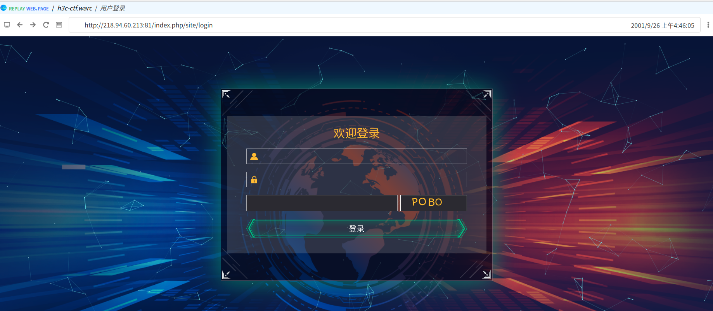

# burp-webarchive

## 介绍

burp-webarchive是基于`har2warc`开发的网站缓存文件转换工具，它可以将从BurpSuite导出的XML文件转换成WARC格式的网站缓存文件，因此你可以快捷地将BurpSuite访问过的网站缓存起来，必要时重新渲染并浏览。

## 截图

程序运行界面展示：

传入参数：

使用[replayweb](https://replayweb.page/)导入WARC文件：

使用[replayweb](https://replayweb.page/)重放网站：

