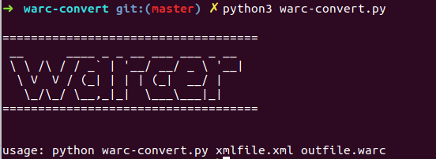
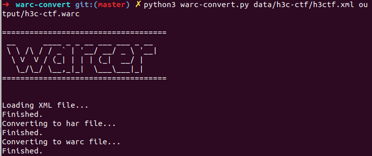
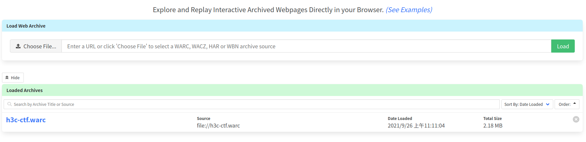

# burp-webarchive

## 0x00 介绍

burp-webarchive是基于 `har2warc` 开发的网站缓存文件转换工具，它可以将从 BurpSuite 导出的 XML 文件转换成 WARC 格式的网站缓存文件，因此你可以快捷地将 BurpSuite 访问过的网站缓存起来，必要时重新渲染并浏览。

## 0x01 快速开始

```bash
python3 -m pip install warconvert
python3 -m warconvert burp2warc input.xml output.warc
```

## 0x02 使用 BurpSuite


## 0x02 截图

程序运行界面展示：



传入参数：



使用 [replayweb](https://replayweb.page/) 导入WARC文件：



使用 [replayweb](https://replayweb.page/) 重放网站：